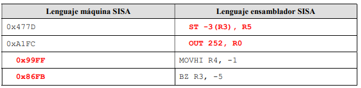
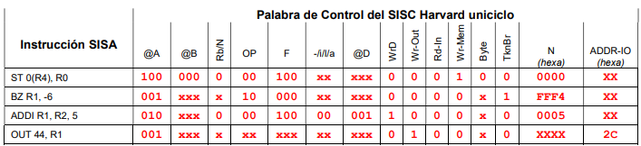
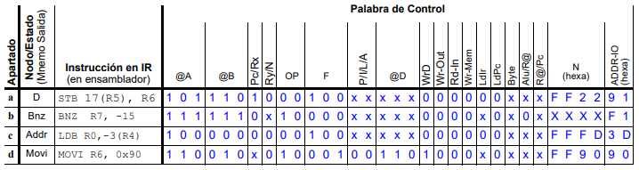

# Sisa Program
Eina d'ajuda per a la matèria d'Introducció als Computadors (IC).
Dirigida als estudiants de 1r any de la FIB, Universitat Politècnica de Catalunya.

Contacte:
* Email: joan.caballero@estudiantat.upc.edu

# Instal·lació i Execució del programa
1. Baixa el fitxer __sisaprogram__ i guarda'l en qualsevol directori.
2. Amb una terminal o compilador dirigeix-te a la ubicació de l'arxiu (les comandes `ls` i `cd` et poden ajudar).
3. Escriu `./sisaprogram` per executar el programa.

# Característiques
* Conversor de nombre hexadecimal a Llenguatge ensamblador SISA.

     **Input:** `-h 1854`. **Output:** `CMPLTU R2, R4, R1`.
     
     
     
* Conversor d'Instrucció SISA a Paraula de Control del SISC Harvard unicicle (Temes 8-11).

     **Exemple d'Input:** `-c1 BNZ R7 -12`, `-c1 ST 0 R4 R0`, etc.
     

* Conversor d'Instrucció SISC Von Neumann a Paraula de Control del SISC CONTROL UNIT (Temes 12-14). [Treballant Actualment]

     **Exemple d'Input:** `-c2 JALR R4 R5`, `-c2 LDB R1 1 R6`, etc.
     
